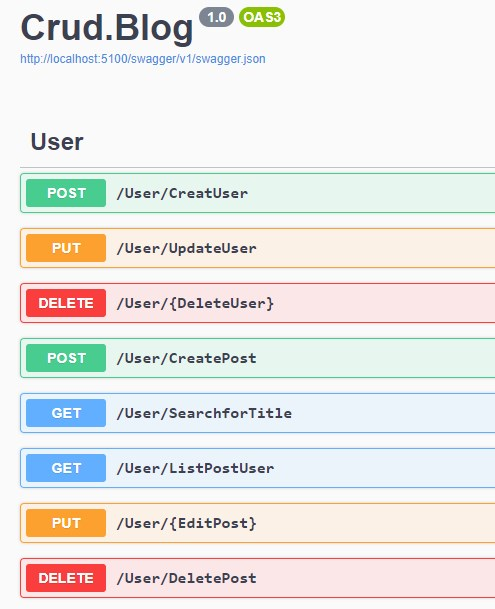
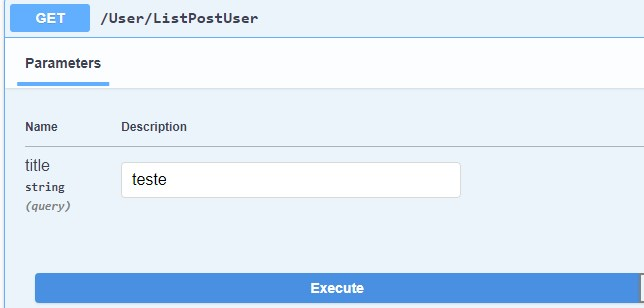
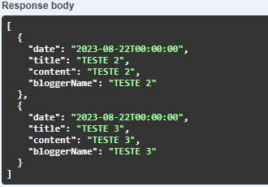

# Blog Api
API para gerenciamento de um Blog com CRUD 🤳


## Índice
- <a href="#funcionalidades">Funcionalidades do Projeto</a>
- <a href="#demostração">Demonstração</a>
- <a href="#rodar">Como rodar o projeto?</a>
- <a href="#tecnologia">Tecnologias Utilizadas</a>
- <a href="#passos">Próximos Passos</a>

## 📱 Funcionalidades do Projeto:
- [x] Criação de usuário
- [x] Atualização de usuário
- [x] Exclusão de usuário
- [x] Criação de um Post
- [x] Busca pelo Título
- [x] Listar Posts com nome de criador
- [x] Edição do Post
- [x] Exclusão do Post


## Demonstração:
- Exemplo de Listar Posts com nome de criador:

Endponts:


Request:


Response:
  


## 👩🏻‍💻 Como rodar o projeto?
Você precisara de alguns softwares instalados em sua máquina: 

 - Visual Studio Code [Link](https://code.visualstudio.com/download)
 - Microsoft SQL Server (clique em express)  [Link](https://www.microsoft.com/pt-pt/sql-server/sql-server-downloads?rtc=1)
 - Microsoft .NET [Link](https://dotnet.microsoft.com/pt-br/download)
- Git [Link](https://git-scm.com/downloads)

E seguir os seguintes passos: 

```bash
# Clone este repositório
$ git clone https://github.com/ihaunt/Blog.Api.git

# Acesse a pasta do projeto no seu terminal
$ cd Blog.Api

#Execute a aplicação
$ dotnet watch run

# A Aplicação será iniciada na porta 5100, acesse pelo navegador 

http://localhost:5100/swagger/index.html

```


## 🤖 Tecnologias Utilizadas:

- Microsoft AspNetCore Version: 7.0.10
- Microsoft EntityFrameworkCore Design Version: 7.0.10
- Microsoft EntityFrameworkCore SqlServer Version: 7.0.10
- Swashbuckle AspNetCore Version: 6.5.0
- Microsoft .NET SDK 7.0.307


  <a href="https://www.linkedin.com/in/jennifer-machado-silva/" target="_blank"></a> 


## 👣 Próximos Passos:
- [] Implementação de recursos para autenticação, para que apenas usuários autorizados possam editar posts;
- [] Implementação de funcionalidades para curtir e comentar.
